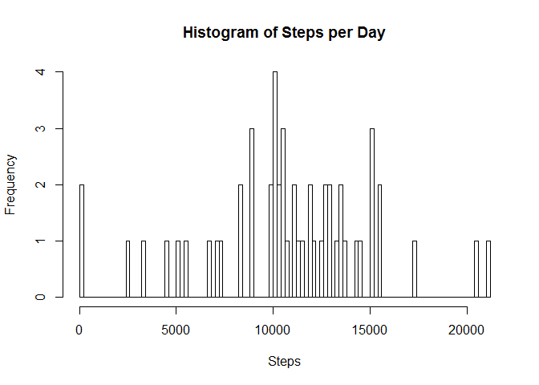
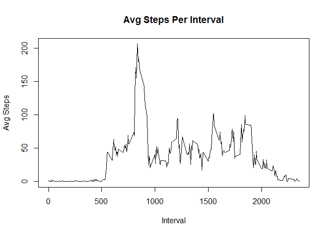
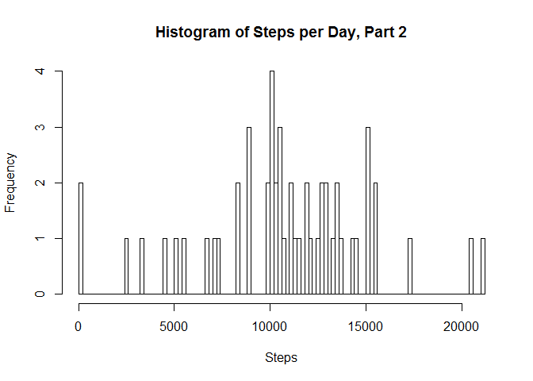

    library(knitr)

    ## Warning: package 'knitr' was built under R version 3.3.3

    library(lattice)
    knitr::opts_chunk$set(echo = TRUE)
    #setwd("/Users/talnoznisky/desktop/repro/report")
    df <- read.csv(file="activity.csv")

Question 1: What is mean total number of steps taken per day?

    knitr::opts_chunk$set(echo = TRUE)
    stepsperday <- aggregate(steps ~ date, data=df, FUN=sum)
    hist(stepsperday$steps, main= "Histogram of Steps per Day",xlab="Steps",breaks = 100)

    mean(stepsperday$steps)

    ## [1] 10766.19

    median(stepsperday$steps)

    ## [1] 10765

Question 2: What is the average daily activity pattern?

    knitr::opts_chunk$set(echo = TRUE)
    intervalsteps <-  aggregate(steps ~ interval , df, FUN=mean)
    plot(intervalsteps, type="l", ylab="Avg Steps", xlab="Interval", main="Avg Steps Per Interval")

    intervalsteps[which.max(intervalsteps$steps),]

    ##     interval    steps
    ## 104      835 206.1698

Question 3: Imputing Missing Values?

    knitr::opts_chunk$set(echo = TRUE)
    options(warn=-1)
    df1 <- df
    sum(is.na(df$steps))

    ## [1] 2304

    df1$steps[which(is.na(df1$steps))] <- intervalsteps[match(df1$interval,intervalsteps$interval),]$steps
    hist(aggregate(steps ~ date, data=df, FUN=sum)$steps, main= "Histogram of Steps per Day, Part 2",xlab="Steps",breaks = 100)

Question 4: Is there a difference by factor of weekday vs. weekend?

    week <- unique(weekdays(as.Date(df$date)))
    df1 <- df
    df1 = within(df1,{
      day = ifelse(weekdays(as.Date(date))%in%week[1:5],"weekday","weekend")
    })
    intervalsteps2 <-  aggregate(steps ~ interval+day , df1, FUN=mean)
    with(intervalsteps2, xyplot(steps~interval|day, type="l",layout=c(1,2)),ylab="Avg Steps", xlab="Interval", main="Avg Steps Per Interval (wkday vs wkend)")

